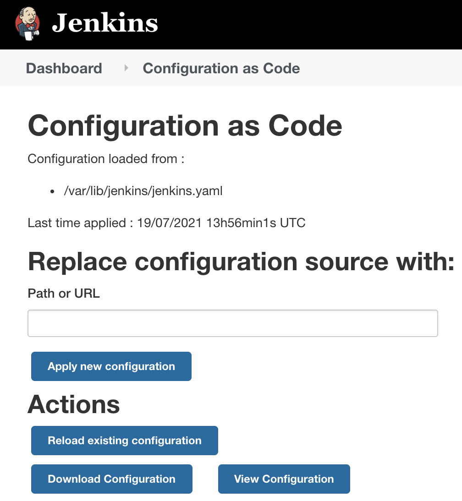
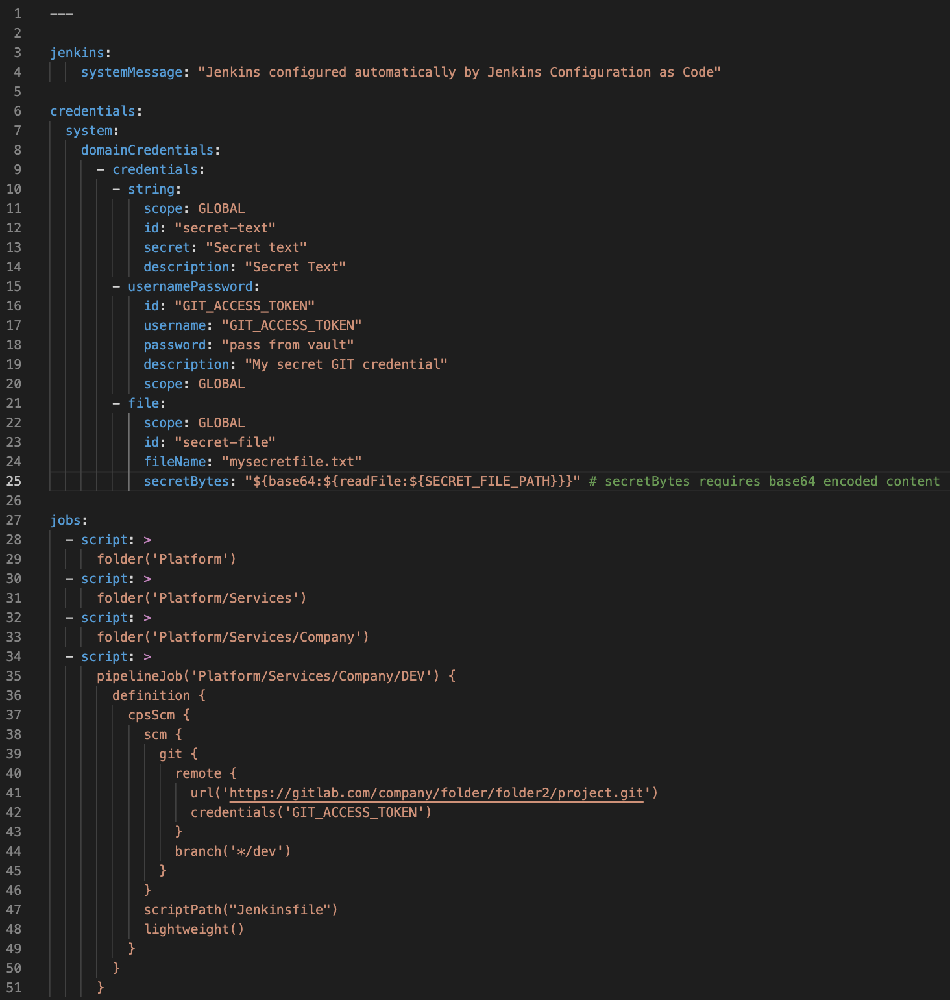
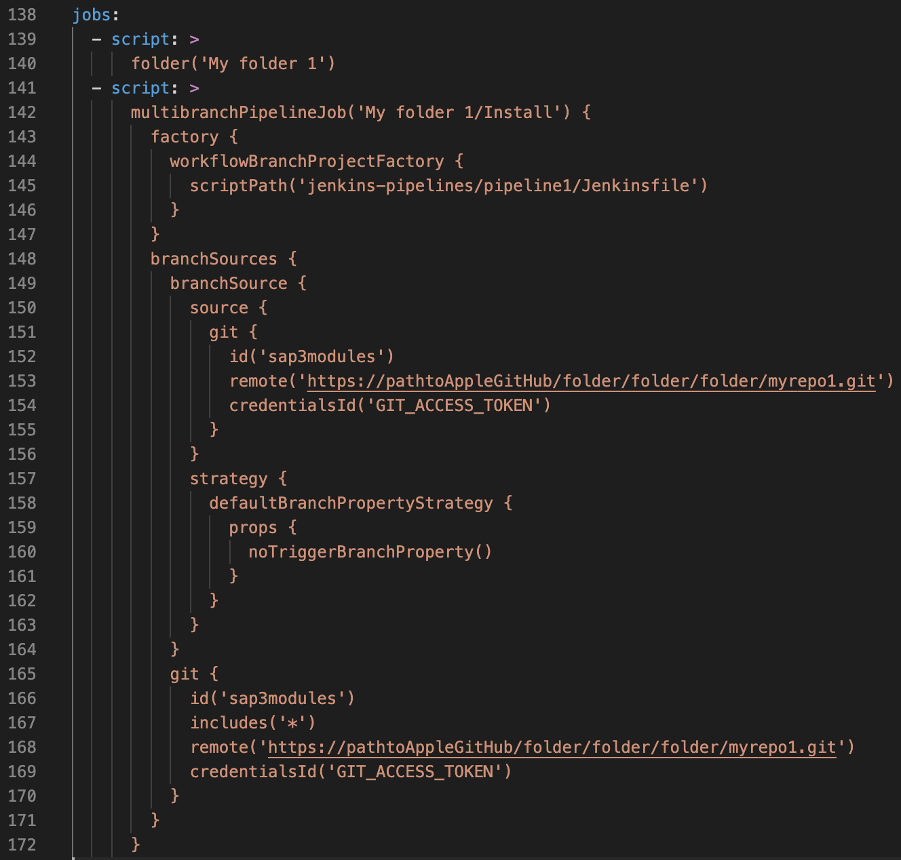

# Using JCasc to Migrate Jenkins jobs and credentials

On this repo's file ```roles > ansible-role-jenkins > files > jenkins.yaml``` there's some examples of how to use the plugin. You can either:
1. Describe the credentials and ALL the jobs needed for this Jenkins installation on the file (which will generate a BIG file)
2. Describe just the credentials and a couple of pilot-light jobs that will subsequently load all the remaining jobs using the source code you prefer to use

Important notes about the migration strategy:
* It's highly recommended to migrate the jobs testing them little by little instead of importing a big package of jobs all at once. This is because small misconfigurations to the jenkins.yaml file can cause errors during the import, and if there's a bigger file it will be harder to understand where the error actually is.
* Once an error occurs, you can check Jenkins's default log files (default location is on ```/var/log/jenkins```) to find the exact row where the misconfiguration is
* Jenkins will try to load, once it's process is started/restarted, the configuration file it finds on ```/var/lib/jenkins/jenkins.yaml```
* You can ask Jenkins to load/reload the configurations either by using the UI (picture below) or by calling the URL: https://my-jenkins-url/configuration-as-code/reload. You will instantly receive feedback about whether the import finished successfully or not.



### Current jenkins.yaml file examples



### Adding more complex jobs examples



Below are the key features of this multibranchpippeline job explained row by row:

1. ```145``` - Custom place where the Jenkinsfile is inside the destination repo. Just use this if the Jenkinsfile is not on the root of the target repo
2. ```152``` - There cannot be two jobs with the same ID on the same file
3. ```153``` - The path for the repository containing the job information you want to use
4. ```154``` - The existing credentials (already declared on top of the same file) to use to retrieve the repo of above line. This credential won't be used or checked until run-time.
5. ```160``` - MultibranchPipelines have by characteristic a self-trigger to fetch all branches and run all branche's jobs just once, as soon as they are created. This property disables this auto-fetch behavior.

---

# FAQ:

### 1 - What is JCasc?
JCasc is a Jenkins plugin that allows you to configure Jenkins Jobs, Credentials and some other items using code. More info: (1) https://www.jenkins.io/projects/jcasc/ and (2) https://github.com/jenkinsci/configuration-as-code-plugin/blob/master/README.md

### 2 - What is Job DSL?
JobDSL is a Jenkins plugin that allows you to describe your jobs on yaml-like sintax. More info: (1) https://plugins.jenkins.io/job-dsl/ (2) https://github.com/jenkinsci/job-dsl-plugin/README.md

### 3 - Where can I find my current JCasc's version's documentation? 
To find the full Job description language capabilities, refer to: https://my-jenkins-url/plugin/job-dsl/api-viewer/index.html

### 4 - Where can I find some more examples of how to use JCasc?
Go to folder "demos" on Github repo: https://github.com/jenkinsci/configuration-as-code-plugin